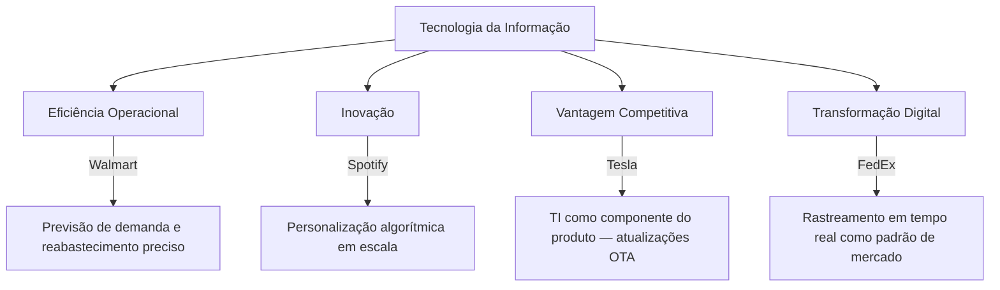
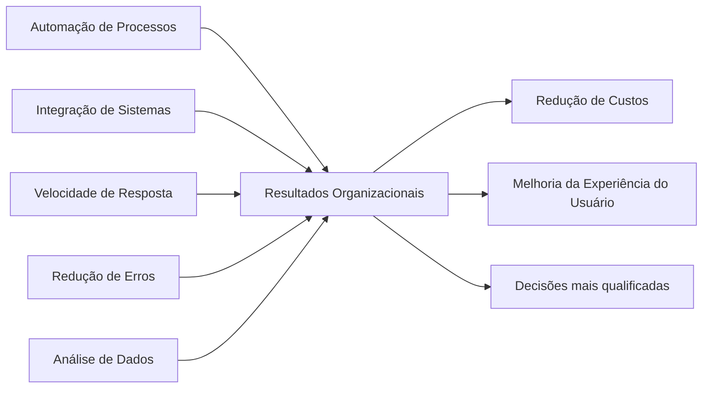
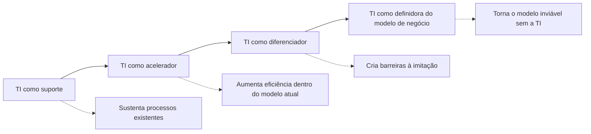
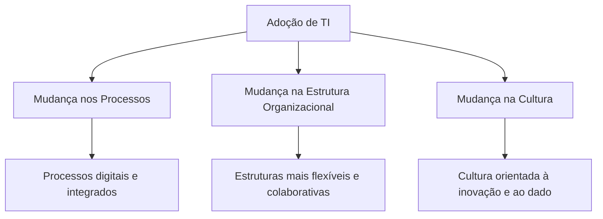

# Esquemas Conceituais — Aula 03: Impacto da TI nos Negócios

## Dimensões do Impacto Organizacional da TI

---

## TI como Fator de Eficiência — Mecanismos

---

## Espectro do Impacto da TI

Do suporte operacional à redefinição do modelo de negócio.

---

## Impactos Organizacionais Internos

