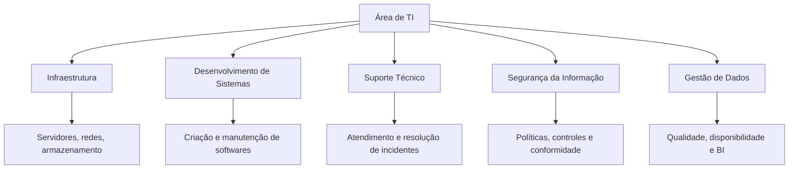
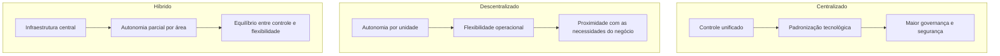
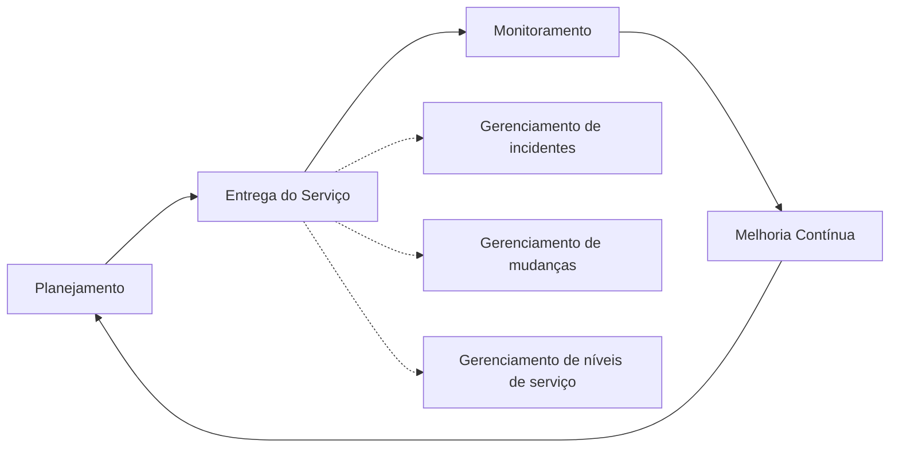
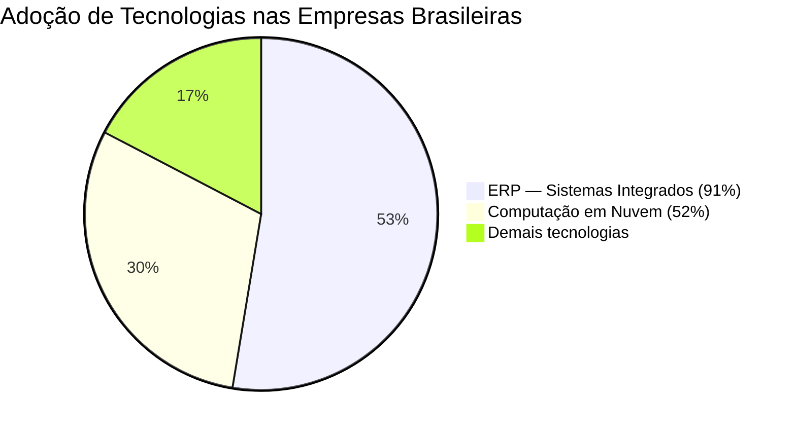
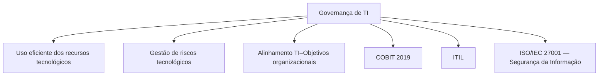

# Esquemas Conceituais — Aula 04: TI nas Organizações

## Estrutura Interna da Área de TI

---

## Modelos de Organização da TI

---

## Gestão de Serviços de TI — Ciclo ITIL

---

## Dados da Pesquisa FGV (2025) — Uso de TI nas Empresas Brasileiras

---

## Governança de TI — Objetivos e Instrumentos

