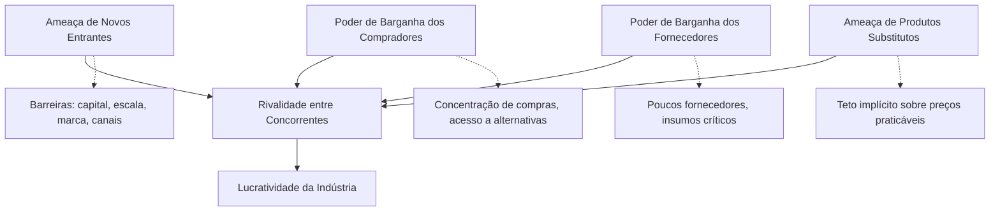
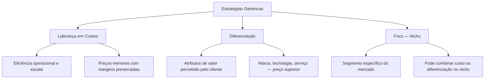
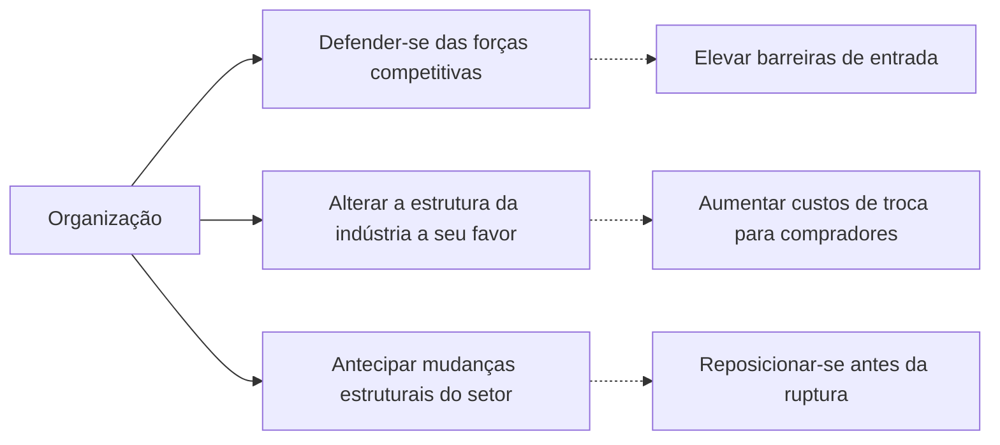
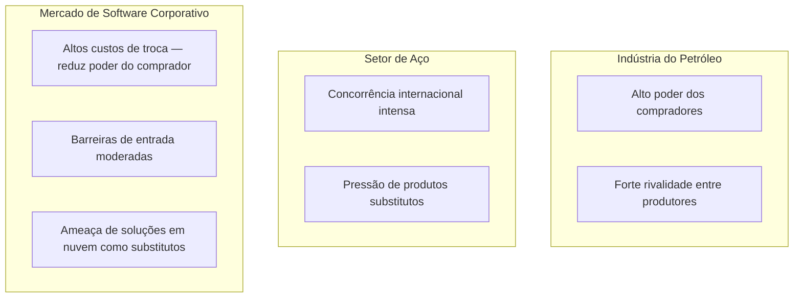

# Esquemas Conceituais — Aula 05: Estratégia Competitiva (Porter, 1997)

## As Cinco Forças Competitivas

---

## Estratégias Genéricas de Porter

---

## Dinâmica Estratégica — Posições Possíveis

---

## Exemplos de Setores — Intensidade das Forças

