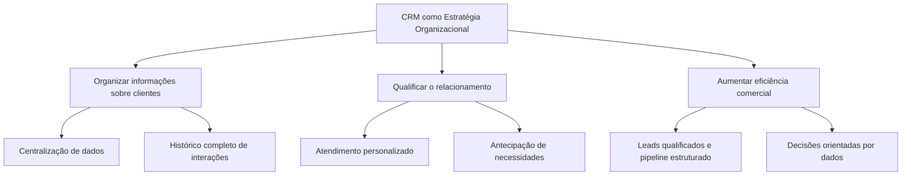
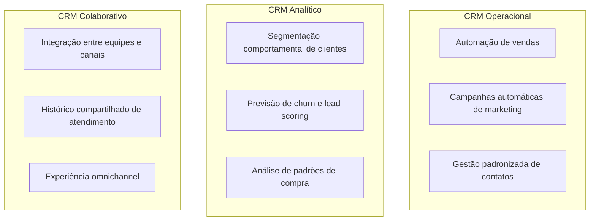
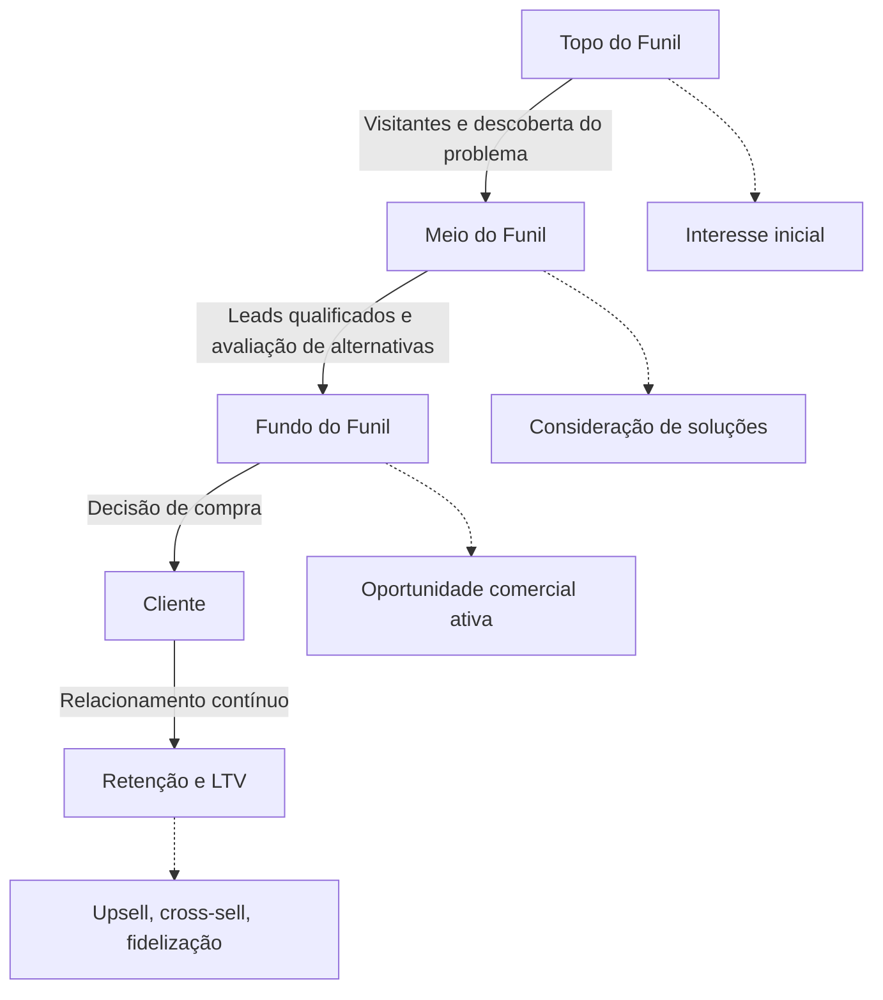
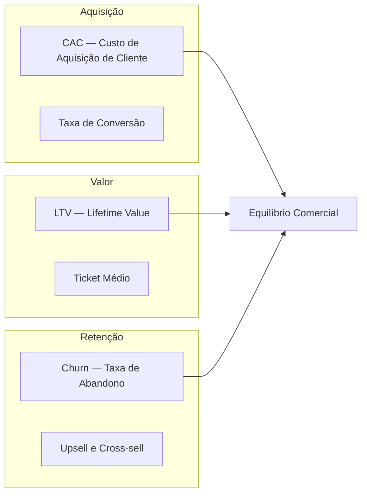
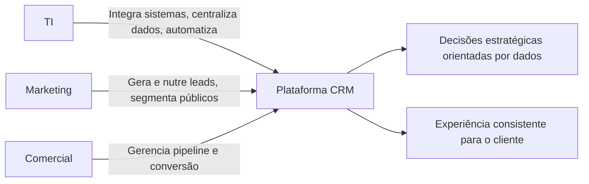

# Esquemas Conceituais — Aula 06: CRM (Customer Relationship Management)

## Objetivos do CRM nas Organizações

---

## Tipos de CRM

---

## Funil de Vendas e Jornada do Cliente

---

## Principais Métricas de CRM

---

## Integração TI, Marketing e Comercial no CRM

